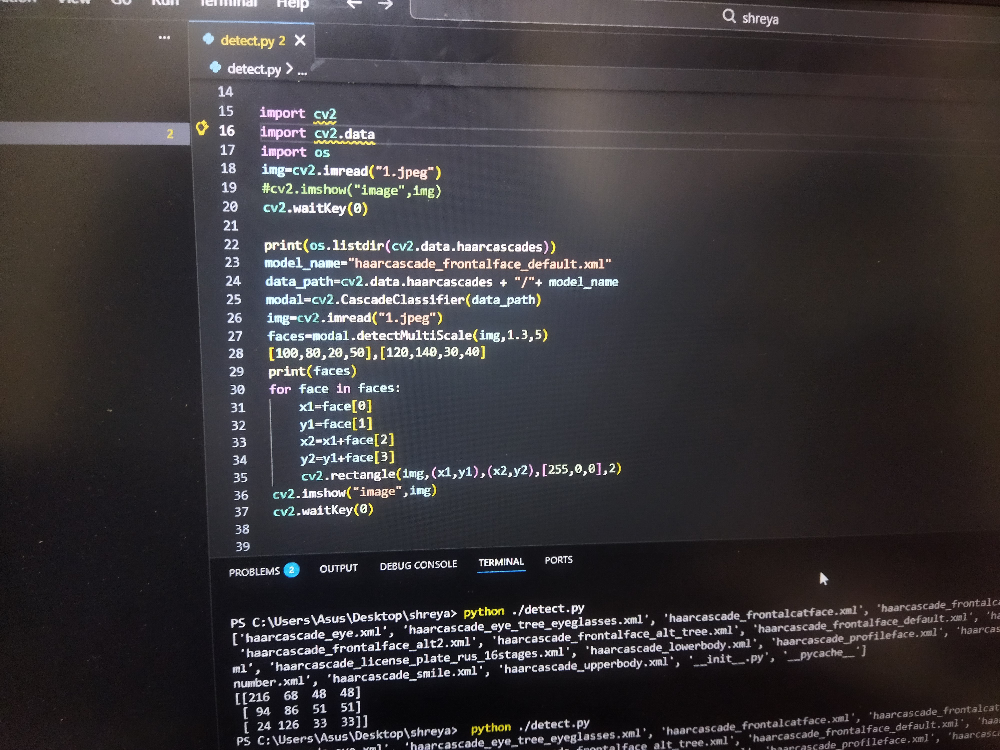
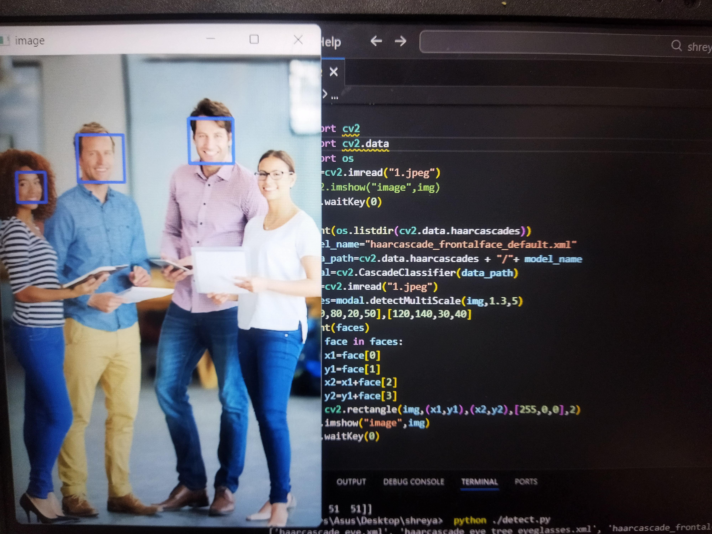

# Face-Detection-Using-OpenCV-Python
This project implements face detection using Python and OpenCV with the Haar Cascade Classifier.  It detects multiple human faces in an image, converts the image to grayscale for processing,  and draws bounding boxes around detected faces.  A beginner-friendly computer vision project to understand image processing and object detection.
# Face Detection Using OpenCV (Python)

This project demonstrates face detection using Python and OpenCV with the Haar Cascade Classifier.
It detects multiple faces in an image and draws bounding boxes around them.

## 📌 Features
- Detects multiple human faces
- Uses Haar Cascade Classifier
- Draws rectangles around detected faces
- Simple and beginner-friendly project

## 🛠 Tech Stack
- Python
- OpenCV (cv2)
- Haar Cascade XML
## 📸 Output
The program detects faces and displays the image with bounding boxes.

## 📚 Learning Outcome
- Basics of Computer Vision
- Face Detection using Haar Cascade
- Image processing with OpenCV
- Working with real images in Python
## 📸 Output

*Detected multiple faces using Haar Cascade Classifier*
